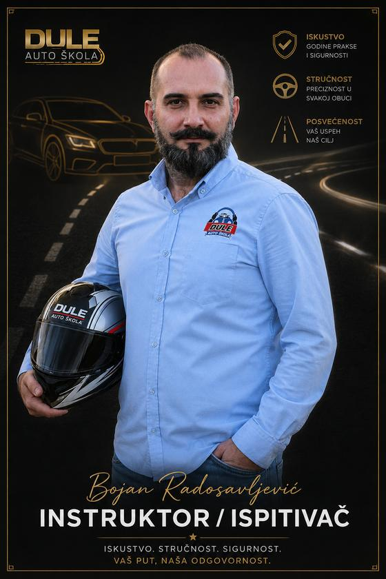

# Auto škola Dule — sajt

Statički sajt za Auto školu Dule (Kruševac i Varvarin). Bez build alata,
bez zavisnosti, bez frejmvorka. Otvoriš `index.html` i radi — lokalno i na
GitHub Pages podjednako.

---

## Sadržaj

- [Pokretanje](#pokretanje)
- [Struktura projekta](#struktura-projekta)
- [Kako je kod organizovan](#kako-je-kod-organizovan)
- [Uvodna scena](#uvodna-scena)
- [Otpornost na otkaz](#otpornost-na-otkaz)
- [Pristupačnost](#pristupačnost)
- [Odakle su podaci](#odakle-su-podaci)
- [Šta je ostalo da se uradi](#šta-je-ostalo-da-se-uradi)

---

## Pokretanje

Dvoklik na `index.html`. To je sve.

Za lokalni server (potreban samo ako testiraš Google mapu ili neku
funkciju koja traži `http://`):

```bash
python3 -m http.server 8000
```

**Objavljivanje na GitHub Pages:** postavi sadržaj ovog foldera u koren
repozitorijuma i u podešavanjima uključi Pages sa `main` grane. Nema koraka
izgradnje.

---

## Struktura projekta

```
AutoSkolaDule/
├── index.html          jedina stranica
├── style.css           sav CSS
├── main.js             sav JavaScript
├── README.md
├── images/             fotografije i SVG ilustracije
├── video/              snimak za uvod (opciono, vidi video/README.md)
├── audio/              zvučni efekti (opciono, vidi audio/README.md)
└── icons/              favicon i ikone aplikacije (vidi icons/README.md)
```

**U HTML-u nema ugrađenih slika.** Svaka slika je zaseban fajl u `images/`
i poziva se običnom relativnom putanjom:

```html

```

**U HTML-u nema ni CSS-a ni JavaScripta.** Nema `<style>` blokova, nema
inline `style` atributa, nema inline `<script>`. Sve je u `style.css` i
`main.js`.

Jedini izuzetak su sitne SVG ikone u interfejsu i vozilo iz uvodne scene,
koji ostaju u HTML-u namerno — CSS i JavaScript pristupaju njihovim
unutrašnjim delovima (žmigavci, stop svetla, tačka izduvne cevi), što kroz
`` nije moguće.

---

## Kako je kod organizovan

### `style.css`

Podeljen je na numerisane celine, redom kojim se pojavljuju na stranici:

| # | celina |
|---|--------|
| 1 | uvodna scena |
| 2 | zajednički elementi, promenljive, tipografija |
| 3 | navigacija |
| 4 | hero sekcija |
| 5 | instrument tabla sa statistikom |
| 6 | kategorije |
| 7 | put do dozvole |
| 8 | ponude (online predavanja, kondicioni časovi) |
| 9 | naš tim |
| 10 | cinematic prelaz između sekcija |
| 11 | cenovnik |
| 12 | lokacije i mape |
| 13 | česta pitanja |
| 14 | poziv na upis |
| 15 | kontakt |
| 16 | podnožje |
| 17 | pristupačnost — smanjena animacija |
| 18 | pomoćne klase i izračunata geometrija |

Osamnaesta celina drži i položaje 23 crte središnje linije na CTA putu.
Vrednosti su izračunate perspektivnom projekcijom, pa su tu kao `nth-child`
pravila umesto kao inline stilovi — ne diraj ih ručno.

Boje, razmaci i fontovi stoje kao CSS promenljive na vrhu fajla. Ako menjaš
temu, menjaj njih, ne pojedinačna pravila.

### `main.js`

Sve je u jednoj funkciji koja se odmah izvršava, da ne curi u globalni
prostor. Podeljena je na numerisane celine:

| # | celina |
|---|--------|
| 1 | zvuk (Web Audio sinteza) |
| 2 | put — perspektivna projekcija na canvas-u |
| 3 | dim — čestice na canvas-u |
| 4 | tok uvodne scene |
| 5 | navigacija |
| 6 | skrol: traka napretka i otkrivanje sekcija |
| 7 | kategorije (podaci i prikaz) |
| 8 | kontakt forma |
| 9 | učitavanje prave mape na klik |

Podaci o kategorijama stoje u objektu `KATEGORIJE` na početku sedme celine.
Da promeniš tekst kategorije, menjaš samo taj objekat — ne diraj HTML.

---

## Uvodna scena

Prvo što posetilac vidi je scena sa automobilom koji kreće putem, iz koje
se izlazi pritiskom na papučicu gasa.

Sastavljena je iz tri sloja:

1. **Nacrtana scena** — SVG vozilo i canvas na kojem se crtaju asfalt,
   isprekidana linija u perspektivi, siluete grada i dim. Uvek radi.
2. **Video** — opcioni sloj preko scene. Učitava se samo ako su putanje
   upisane u `data-mp4` i `data-webm` atribute video elementa. Dok su
   prazni, nijedan zahtev se ne šalje.
3. **Zvuk** — podrazumevano se sve sintetizuje preko Web Audio API-ja, bez
   ijednog fajla. Isključen je dok ga korisnik ne uključi.

Scena se preskače dugmetom, tasterom `Esc` ili papučicom gasa. Izbor se
pamti za tu sesiju, pa se pri kretanju kroz sajt ne ponavlja.

---

## Otpornost na otkaz

Uvodna scena ne sme nikada da sakrije sajt. Zato:

- `<div class="intro" hidden>` — prikazuje se tek kad je `main.js` uspešno
  pokrene i doda klasu `je-aktivan`; CSS pravilo
  `.intro:not(.je-aktivan) { display: none }` je druga brava
- skrol se zaključava klasom `body.intro-otvoren`, ne inline stilom, pa se
  uvek može otključati
- pokretanje scene je pod `try/catch`; svaka greška gasi scenu i prikazuje sajt
- `window.addEventListener('error')` otključava stranicu i kod greške koja
  dođe sa druge strane
- ako se papučice ne pojave posle 12 sekundi, prikazuju se prinudno
- zaglavlje je vidljivo podrazumevano, skriva se samo dok scena traje

Sekcije koje se otkrivaju na skrol su vidljive podrazumevano; kriju se samo
ako pregledač izvršava JavaScript (`@media (scripting: enabled)`), jer ga
tek tada ima ko ponovo prikazati.

---

## Pristupačnost

- kontrasti provereni po WCAG merilu; najniži je 4,8:1, većina preko 7:1
- `prefers-reduced-motion` gasi sve animacije, uključujući uvodnu scenu
- kategorije rade kao tabovi sa strelicama i `aria-selected`
- svaka slika ima `alt`; ukrasne imaju prazan `alt` i `aria-hidden`
- imena i funkcije članova tima stoje u `alt` opisima, jer su na samim
  grafikama — bez toga bi sekcija za pretraživače i čitače ekrana bila
  prazna

---

## Odakle su podaci

Sav sadržaj je sa zvaničnog sajta [autoskoladule.rs](https://autoskoladule.rs)
ili iz materijala koje je dostavio klijent. Ništa nije izmišljeno.

- opisi kategorija, uslovi i broj časova — sa stranica `obuka-vozaca-za-*`
- cenovnik — sa zvanične grafike cenovnika koju je dostavio klijent
- podaci o školi (osnovana juna 2018, preko 80% upisanih na preporuku,
  osam kategorija, dve lokacije) — sa stranice „O nama"
- kartice tima i fotografije vozila — dostavio klijent

**Mape lokacija su stilizovane ilustracije i ne prikazuju stvarni raspored
ulica.** To piše i na samoj stranici. Prava lokacija ide preko dugmadi ka
Google Maps, a pravi embed se učitava tek na klik — da se podaci posetioca
ne šalju Google-u dok on to ne zatraži.

---

## Šta je ostalo da se uradi

1. **Logo u visokoj rezoluciji.** Postojeći `images/logo.png` je 234×242 px,
   pa je u hero sekciji smanjen na 168 px da bi bio oštar. Potreban je SVG
   ili PNG širine bar 1000 px, posle čega se u `style.css` može podići
   vrednost promenljive `--hero-logo`.
2. **Kontakt forma nije povezana sa serverom.** Trenutno sastavlja poruku i
   otvara je u programu za poštu korisnika. Na hostingu je povezati preko
   servera (PHP skripta, Formspree ili slično) i dodati zaštitu od spama.
3. **Datum važenja cenovnika** — dopisati kad klijent potvrdi.
4. **Fotografije voznog parka su 1024 px široke.** Za traku preko cele
   širine ekrana to je na granici; ako postoje originali iz aparata, zameniti.
5. **Favicon** — vidi `icons/README.md`.
6. **Broj vozila** — na sajtu se ne navodi, jer se izvori nisu slagali
   (početna je govorila 12, „O nama" daje zbir od 13). Ako klijent potvrdi
   tačan broj, može se vratiti na instrument tablu.

---

## Podržani pregledači

Poslednje dve verzije Chrome-a, Firefox-a, Safari-ja i Edge-a. Korišćene su
`offset-path`, `aspect-ratio`, `clip-path`, `backdrop-filter` i
`@media (scripting)`. Gde nešto nije podržano, sajt se gracioznо degradira —
sadržaj ostaje čitljiv, gubi se samo animacija.
